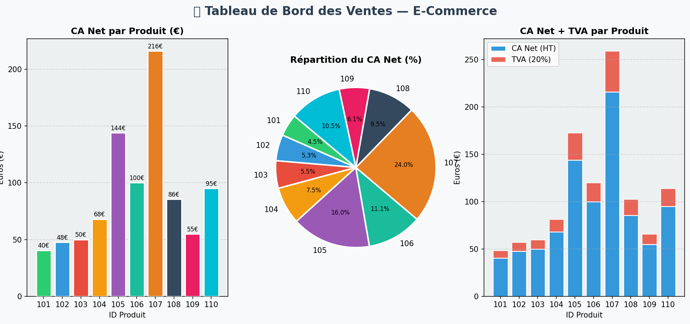

<div align="center">


<br/>


<br/>
<i>Script Python d'analyse automatique de données e-commerce</i>

</div>

---

<div style="background-color:#e8f5e9; padding:40px; border-radius:0px; color:black;">
  <strong style="font-size:40px;">📋 Description</strong>
  <p style="margin-top:10px;">
    Ce projet automatise l'analyse des ventes d'une entreprise <strong>e-commerce</strong>.
    Il lit un fichier CSV, effectue des <strong>calculs financiers</strong> (CA Brut, CA Net, TVA)
    et génère un <strong>rapport complet</strong> ainsi que des <strong>graphiques visuels</strong>.
  </p>
  <ul>
    <li>Génération automatique du fichier de ventes</li>
    <li>Calcul du Chiffre d'Affaires Brut et Net</li>
    <li>Application des remises et calcul de la TVA</li>
    <li>Identification du produit le plus rentable</li>
    <li>Export des résultats dans un fichier CSV final</li>
    <li>Visualisation graphique avec Matplotlib</li>
  </ul>
</div>

---

<div style="background-color:#fff9c4; padding:40px; border-radius:0px; color:black;">
  <strong style="font-size:30px;">🎯 Objectifs</strong>
  <ul>
    <li>Automatiser l'analyse de données de ventes e-commerce</li>
    <li>Appliquer les calculs financiers (CA Brut, CA Net, TVA)</li>
    <li>Maîtriser la lecture et l'écriture de fichiers CSV en Python</li>
    <li>Générer des graphiques professionnels avec Matplotlib</li>
    <li>Utiliser Git et GitHub pour la gestion de versions</li>
  </ul>
</div>

---

<div style="background-color:#f1f8e9; padding:40px; border-radius:0px; color:black;">
  <strong style="font-size:30px;">✨ Fonctionnalités</strong>
  <ul>
    <li>Génération automatique de <code>ventes.csv</code> par le code</li>
    <li>Calcul du CA Brut : Prix × Quantité</li>
    <li>Calcul du CA Net : CA Brut × (1 − Remise%)</li>
    <li>Calcul de la TVA à 20% sur le CA Net</li>
    <li>Affichage du CA Total de l'entreprise dans le terminal</li>
    <li>Identification du produit avec le plus gros bénéfice</li>
    <li>Export de <code>resultats_final.csv</code> avec toutes les colonnes</li>
    <li>3 graphiques Matplotlib : barres, camembert, barres empilées</li>
  </ul>
</div>

---

<div style="background-color:#e8eaf6; padding:40px; border-radius:0px; color:black;">
  <strong style="font-size:40px;">🛠️ Stack Technique</strong>
  <table>
    <tr><th>Technologie</th><th>Rôle</th></tr>
    <tr><td>Python 3.14</td><td>Logique métier et calculs</td></tr>
    <tr><td>CSV (module Python)</td><td>Lecture et écriture des données</td></tr>
    <tr><td>Matplotlib</td><td>Génération des graphiques</td></tr>
    <tr><td>Git / GitHub</td><td>Gestion de versions</td></tr>
    <tr><td>VS Code</td><td>Environnement de développement</td></tr>
  </table>
</div>

---

## 🧮 Formules utilisées

```
CA Brut  =  Prix × Quantité
CA Net   =  CA Brut × (1 − Remise / 100)
TVA      =  CA Net × 0.20
CA TTC   =  CA Net + TVA
```

---

## 📂 Structure du Projet

```
automatisation-ventes/
│
├── 🐍 analyse_ventes.py       ← Script principal (à lancer)
├── 📄 requirements.txt        ← Dépendances Python
├── 📖 README.md               ← Ce fichier
├── 🔒 .gitignore              ← Fichiers exclus de Git
└── 📁 photos/                 ← Photos équipe + aperçu graphiques
    ├── mouna.jpg
    ├── mariem.jpg
    ├── chawk.jpg
    ├── raed.jpg
    ├── tasnim.jpg
    └── graphiques.png
```

> ⚠️ Les fichiers `ventes.csv`, `resultats_final.csv` et `graphiques_ventes.png` sont **générés automatiquement** — non inclus dans le dépôt.

---

<div style="background-color:#e3f2fd; padding:40px; border-radius:0px; color:black;">
  <strong style="font-size:30px;">🚀 Installation & Lancement</strong>
  <ol>
    <li>Cloner le projet : <code>git clone https://github.com/mounab3/ventes-automatisation.git</code></li>
    <li>Installer les dépendances : <code>pip install -r requirements.txt</code></li>
    <li>Lancer le script : <code>py analyse_ventes.py</code></li>
  </ol>
</div>

---

## 📊 Aperçu des graphiques

> Les 3 graphiques sont générés automatiquement au lancement du script.



---

## 💡 Exemple de sortie terminal

```
🛒 🛒 🛒 🛒 🛒 🛒 🛒 🛒 🛒 🛒
   DÉMARRAGE — Analyse automatique des ventes

✅ Fichier 'ventes.csv' généré avec 10 produits.

════════════════════════════════════════════════════════════════
  📊  RAPPORT DE VENTES — CHIFFRE D'AFFAIRES
════════════════════════════════════════════════════════════════
  ID    Prix   Qté  Remise    CA Brut    CA Net    TVA    CA TTC
────────────────────────────────────────────────────────────────
  101   15.00    3     10%     45.00     40.50    8.10    48.60
  102   25.00    2      5%     50.00     47.50    9.50    57.00
════════════════════════════════════════════════════════════════
  💰  CA Total (HT) : 1025.60 €
  🏦  TVA collectée :  205.12 €
  🧾  CA Total (TTC): 1230.72 €

  🏆  Meilleur produit : ID 107 → CA Net = 216.00 €
✨ Analyse terminée avec succès !
```

---

<div style="background-color:#fce4ec; padding:40px; border-radius:0px; color:black;">
  <strong style="font-size:30px;">🔮 Améliorations Futures</strong>
  <ul>
    <li>Interface graphique avec Tkinter</li>
    <li>Lecture dynamique de fichiers CSV de tailles différentes</li>
    <li>Connexion à une base de données</li>
    <li>Version web avec Flask</li>
    <li>Tableau de bord interactif</li>
  </ul>
</div>

---

<div style="background-color:#c8e6c9; padding:20px; border-radius:0px; color:black;">
  <strong style="font-size:30px;">👥 Équipe</strong>
  <br/><br/>
  <table>
    <tr>
      <td align="center">
        <br/>
        <b>Mouna Belhiba</b><br/>
      </td>
      <td align="center">
        <br/>
        <b>Mariem Saffar</b><br/>
      </td>
      <td align="center">
        <br/>
        <b>Chawk Mejri</b><br/>
      </td>
    </tr>
  </table>
</div>

---

<div style="background-color:#eeeeee; padding:15px; border-radius:0px; color:black;">
  <strong style="font-size:30px;">📄 LMI2</strong>
  <p>Projet académique réalisé dans le cadre du cours <strong>Logiciels</strong> — 2025.</p>
</div>

---

<div align="center">

</div>
